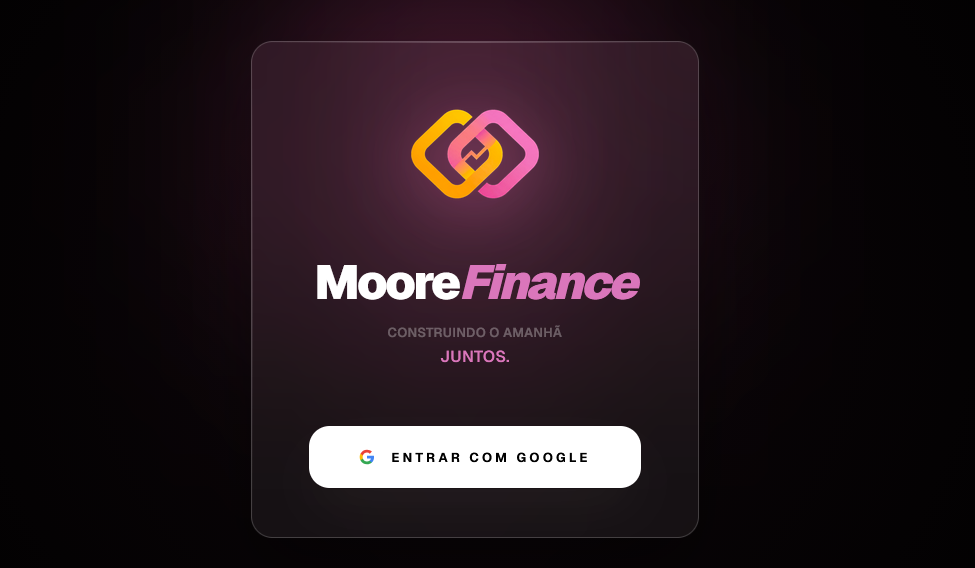

# 💎 Moore Finance

> Uma plataforma premium de gestão de fluxo de caixa pessoal, projetada para quem busca clareza financeira com uma interface state-of-the-art.

## ✨ Sobre o Projeto

O **Moore Finance** nasceu da necessidade de uma ferramenta que fosse além das planilhas tradicionais. Focado em **Fluxo de Caixa** e **Gestão de Cartões**, o sistema oferece uma visão executiva das finanças, automatizando o que é repetitivo e trazendo inteligência para os dados.

Diferente de apps bancários poluídos, o Moore Finance prioriza o **minimalismo funcional** e a **estética premium**, garantindo que o controle financeiro seja uma tarefa prazerosa e rápida.

## 🚀 Funcionalidades Principais

- **📊 Dashboard Executivo:** Visão clara de receitas, despesas pagas e pendências do mês.
- **🔄 Automação de Recorrência:** Lógica inteligente para contas fixas e assinaturas com projeção automática para meses futuros.
- **👥 Gestão Compartilhada:** Suporte a grupos familiares/domésticos com soma de rendimentos e controle individual.
- **💳 Foco em Cash-Flow:** Arquitetura limpa que separa gastos avulsos de obrigações fixas.
- **📱 Experiência Mobile-First:** Interface responsiva otimizada para uso em movimento, com suporte a PWA.
- **🎓 Onboarding Assistido:** Tutorial interativo integrado para novos usuários.

## 🛠️ Stack Tecnológica

O projeto foi construído com o que há de mais moderno no ecossistema web:

- **Frontend:** [React](https://reactjs.org/) + [Vite](https://vitejs.dev/)
- **Linguagem:** [TypeScript](https://www.typescriptlang.org/)
- **Estilização:** [TailwindCSS](https://tailwindcss.com/) & Componentes Customizados
- **Animações:** [Motion (Framer Motion)](https://motion.dev/)
- **Backend/Database:** [Firebase](https://firebase.google.com/) (Firestore & Auth)
- **Deployment:** [Vercel](https://vercel.com/)
- **Ícones:** [Lucide React](https://lucide.dev/)

## 🎨 Design & UX

A interface utiliza conceitos de **Glassmorphism** e **Dark Mode**, com uma paleta de cores harmoniosa baseada em tons de cinza profundo e acentos vibrantes em âmbar e esmeralda. Cada transição foi pensada para ser fluida, eliminando a sensação de "carregamento" constante.

## 🔒 Privacidade

*Este é um projeto proprietário. O código-fonte está em um repositório privado por questões de segurança e propriedade intelectual. Esta página serve como portfólio e documentação das capacidades técnicas aplicadas.*

---
Desenvolvido com ❤️ por Bruno M.
